# User Guide — Scalable Notification Service

A step-by-step guide to running and using the notification service API.

---

## How It Works



---

## In-App Real-Time Flow

```
Browser  ──connect──▶  InApp Service (:8001)
                              │
                              ├─── fetch unread from DB
                              │◀── push on connect
                              │
                     API ─────┤  POST /inapp/broadcast/{user_id}
                              │
                              └──▶ Browser  ⚡ instant push
```

---

## Scheduled Notification Flow

```
Client ──▶ API ──▶ DB  (status: scheduled)

  ┌─────────────────────────────────────┐
  │  Scheduler polls every 60 seconds   │
  │  SELECT WHERE scheduled_at <= NOW() │
  │  → publish to RabbitMQ              │
  │  → update status: queued            │
  └─────────────────────────────────────┘
```

---

## Table of Contents

1. [Prerequisites](#1-prerequisites)
2. [Starting the Stack](#2-starting-the-stack)
3. [Generating a JWT Token](#3-generating-a-jwt-token)
4. [API Endpoints](#4-api-endpoints)
5. [Walkthrough — Send Your First Notification](#5-walkthrough--send-your-first-notification)
6. [End-to-End Test Suite](#6-end-to-end-test-suite)
7. [Notification Channels](#7-notification-channels)
7. [Notification Types](#7-notification-types)
8. [User Preferences](#8-user-preferences)
9. [Scheduling a Notification](#9-scheduling-a-notification)
10. [Monitoring Dashboards](#10-monitoring-dashboards)
11. [WebSocket — Real-Time In-App Notifications](#11-websocket--real-time-in-app-notifications)

---

## 1. Prerequisites

- [Docker](https://docs.docker.com/get-docker/) and Docker Compose installed
- Port availability: `8000`, `8001`, `5432`, `5672`, `6379`, `15672`, `9090`, `3000`

---

## 2. Starting the Stack

```bash
# Clone the repo
git clone https://github.com/kareemadesola/scalable-notification-service.git
cd scalable-notification-service

# Copy environment variables
cp .env.example .env

# Build and start all 11 services
docker compose up --build -d
```

Wait ~90 seconds for RabbitMQ to fully boot, then verify everything is up:

```bash
docker ps --format "table {{.Names}}\t{{.Status}}"
```

Expected output:

```
NAMES                STATUS
ns_api               Up X minutes (healthy)
ns_inapp             Up X minutes
ns_rabbitmq          Up X minutes (healthy)
ns_postgres          Up X minutes (healthy)
ns_push_processor    Up X minutes
ns_sms_processor     Up X minutes
ns_email_processor   Up X minutes
ns_scheduler         Up X minutes
ns_grafana           Up X minutes
ns_redis             Up X minutes (healthy)
ns_prometheus        Up X minutes
```

Confirm the API is live:

```bash
curl http://localhost:8000/health
# → {"status":"ok"}
```

> 💡 The full interactive API docs (Swagger UI) are at **http://localhost:8000/docs**

---

## 3. Generating a JWT Token

All API endpoints require a Bearer token. Since this is a service-to-service API
(no user login UI), you generate a token directly using Python.

**Option A — Python script:**

```python
# generate_token.py
import sys
sys.path.insert(0, "services/api")
from auth import create_access_token

token = create_access_token(subject="my-service")
print(token)
```

```bash
python3 generate_token.py
# → eyJhbGciOiJIUzI1NiIsInR5cCI6IkpXVCJ9...
```

**Option B — one-liner:**

```bash
docker exec ns_api python3 -c "
from auth import create_access_token
print(create_access_token('my-service'))
"
```

Copy the token — you'll use it as `Authorization: Bearer <token>` in every request.

---

## 4. API Endpoints

### Base URL
```
http://localhost:8000
```

### Authentication
All endpoints (except `/health`) require:
```
Authorization: Bearer <your_jwt_token>
```

---

### Notifications

| Method | Endpoint | Description |
|--------|----------|-------------|
| `POST` | `/notifications` | Create and dispatch a notification |
| `GET` | `/notifications/{id}` | Get a notification by ID |
| `PATCH` | `/notifications/{id}` | Update a notification (mark read, change status) |

### Users

| Method | Endpoint | Description |
|--------|----------|-------------|
| `GET` | `/users/{user_id}/notifications` | Paginated inbox for a user |
| `GET` | `/users/{user_id}/preferences` | Get notification preferences |
| `PUT` | `/users/{user_id}/preferences` | Update notification preferences |

---

## 5. Walkthrough — Send Your First Notification

### Step 1 — Get a token

```bash
TOKEN=$(docker exec ns_api python3 -c "from auth import create_access_token; print(create_access_token('demo'))")
echo $TOKEN
```

> `TOKEN=$(...)` runs the command inside `$(...)` and stores the output in a shell variable called `TOKEN`

---

### Step 2 — Create a user in the database

The API requires a valid `user_id` (UUID) that exists in the `users` table.
Insert one directly:

```bash
docker exec -it ns_postgres psql -U postgres -d notifications -c "
INSERT INTO users (email, first_name, last_name)
VALUES ('alice@example.com', 'Alice', 'Smith')
RETURNING id;
"
```

Copy the returned UUID — e.g. `a1b2c3d4-...`

---

### Step 3 — Send an email notification

```bash
curl -X POST http://localhost:8000/notifications \
  -H "Authorization: Bearer $TOKEN" \
  -H "Content-Type: application/json" \
  -d '{
    "user_id": "PASTE-UUID-HERE",
    "type": "transactional",
    "channel": "email",
    "subject": "Welcome to the platform!",
    "body": "Hi Alice, your account is ready."
  }'
```

**Response:**

```json
{
  "id": 1,
  "user_id": "a1b2c3d4-...",
  "type": "transactional",
  "channel": "email",
  "status": "queued",
  "subject": "Welcome to the platform!",
  "body": "Hi Alice, your account is ready.",
  "metadata": null,
  "is_read": false,
  "scheduled_at": null,
  "created_at": "2026-04-29T20:00:00Z",
  "updated_at": "2026-04-29T20:00:00Z"
}
```

The notification is now:
1. Saved in PostgreSQL
2. Published to the `email` RabbitMQ queue
3. Picked up by `ns_email_processor` which logs it (mock mode) or sends via SendGrid (real mode)

---

### Step 4 — Check it was processed

```bash
# Get the notification by ID
curl http://localhost:8000/notifications/1 \
  -H "Authorization: Bearer $TOKEN"
```

```bash
# See the full inbox for Alice
curl "http://localhost:8000/users/PASTE-UUID-HERE/notifications?page=1&page_size=10" \
  -H "Authorization: Bearer $TOKEN"
```

---

### Step 5 — Mark it as read

```bash
curl -X PATCH http://localhost:8000/notifications/1 \
  -H "Authorization: Bearer $TOKEN" \
  -H "Content-Type: application/json" \
  -d '{"is_read": true}'
```

---

## 6. End-to-End Test Suite

Run these commands in order to exercise every endpoint and verify the full pipeline is working. All you need is the stack running (`docker compose up -d`).

---

### Setup — token and user

```bash
# Store a JWT token in a shell variable for reuse
TOKEN=$(docker exec ns_api python3 -c "from auth import create_access_token; print(create_access_token('demo'))")

# Insert a test user and capture their UUID
USER_ID=$(docker exec -i ns_postgres psql -U postgres -d notifications -tAc \
  "INSERT INTO users (email, first_name, last_name)
   VALUES ('alice@example.com', 'Alice', 'Smith')
   ON CONFLICT (email) DO UPDATE SET first_name=EXCLUDED.first_name
   RETURNING id;")

# Seed default preferences for the user
docker exec -i ns_postgres psql -U postgres -d notifications -c \
  "INSERT INTO user_preferences (user_id) VALUES ('$USER_ID') ON CONFLICT DO NOTHING;"

echo "USER_ID: $USER_ID"
echo "TOKEN: $TOKEN"
```

> `ON CONFLICT ... DO UPDATE` = re-run safely even if Alice already exists (upsert)

---

### Test 1 — Health check

```bash
curl -s http://localhost:8000/health
```

**Expected:**
```json
{"status": "ok"}
```

---

### Test 2 — Get user preferences

```bash
curl -s "http://localhost:8000/users/$USER_ID/preferences" \
  -H "Authorization: Bearer $TOKEN"
```

**Expected:** JSON object with all channels enabled and default values.

---

### Test 3 — Update user preferences

```bash
curl -s -X PUT "http://localhost:8000/users/$USER_ID/preferences" \
  -H "Authorization: Bearer $TOKEN" \
  -H "Content-Type: application/json" \
  -d '{"max_promotional_per_day": 3, "dnd_start_hour": 22, "dnd_end_hour": 7}'
```

**Expected:** Updated preferences with `max_promotional_per_day: 3`, `dnd_start_hour: 22`, `dnd_end_hour: 7`.

---

### Test 4 — Send an email notification

```bash
curl -s -X POST http://localhost:8000/notifications \
  -H "Authorization: Bearer $TOKEN" \
  -H "Content-Type: application/json" \
  -d "{\"user_id\":\"$USER_ID\",\"type\":\"transactional\",\"channel\":\"email\",\"subject\":\"Order confirmed\",\"body\":\"Your order #1001 is confirmed.\"}"
```

**Expected:** `status: "queued"` — notification saved and published to RabbitMQ.

**Verify delivery (processor log):**
```bash
docker logs ns_email_processor 2>&1 | grep MOCK | tail -3
# → [MOCK] Email sent  notification_id=X  subject=Order confirmed  to=None
```

---

### Test 5 — Send an SMS notification

```bash
curl -s -X POST http://localhost:8000/notifications \
  -H "Authorization: Bearer $TOKEN" \
  -H "Content-Type: application/json" \
  -d "{\"user_id\":\"$USER_ID\",\"type\":\"transactional\",\"channel\":\"sms\",\"body\":\"Your OTP is 482910. Valid for 5 minutes.\"}"
```

**Expected:** `status: "queued"` — published to `sms` queue.

**Verify:**
```bash
docker logs ns_sms_processor 2>&1 | grep MOCK | tail -3
# → [MOCK] SMS sent  body=Your OTP is 482910...
```

---

### Test 6 — Send a push notification

```bash
curl -s -X POST http://localhost:8000/notifications \
  -H "Authorization: Bearer $TOKEN" \
  -H "Content-Type: application/json" \
  -d "{\"user_id\":\"$USER_ID\",\"type\":\"system_alert\",\"channel\":\"push\",\"subject\":\"Server alert\",\"body\":\"CPU usage at 92% on prod-server-1.\"}"
```

**Expected:** `status: "queued"` — published to `push` queue.

**Verify:**
```bash
docker logs ns_push_processor 2>&1 | grep MOCK | tail -3
# → [MOCK] Push notification sent  title=Server alert
```

---

### Test 7 — Send an in-app notification

```bash
curl -s -X POST http://localhost:8000/notifications \
  -H "Authorization: Bearer $TOKEN" \
  -H "Content-Type: application/json" \
  -d "{\"user_id\":\"$USER_ID\",\"type\":\"transactional\",\"channel\":\"inapp\",\"subject\":\"New message\",\"body\":\"You have a new message from support.\"}"
```

**Expected:** `status: "pending"` — in-app bypasses RabbitMQ and broadcasts directly to WebSocket connections.

---

### Test 8 — Get notification by ID

```bash
# Replace 8 with the id returned from Test 4
curl -s http://localhost:8000/notifications/8 \
  -H "Authorization: Bearer $TOKEN"
```

**Expected:** Full notification object. After a moment the status will show `"delivered"` — the processor already ran.

---

### Test 9 — Mark notification as read

```bash
# Replace 11 with the in-app notification id from Test 7
curl -s -X PATCH http://localhost:8000/notifications/11 \
  -H "Authorization: Bearer $TOKEN" \
  -H "Content-Type: application/json" \
  -d '{"is_read": true}'
```

**Expected:** Same notification returned with `"is_read": true` and a refreshed `updated_at` timestamp.

---

### Test 10 — Schedule a future notification

```bash
echo '{"user_id":"PASTE-UUID","type":"promotional","channel":"email","subject":"Flash sale!","body":"30% off for the next 2 hours.","scheduled_at":"2026-04-30T09:00:00Z"}' \
  | sed "s/PASTE-UUID/$USER_ID/" > /tmp/sched.json

curl -s -X POST http://localhost:8000/notifications \
  -H "Authorization: Bearer $TOKEN" \
  -H "Content-Type: application/json" \
  -d @/tmp/sched.json
```

> Writing JSON to a file with `-d @file` avoids shell quoting issues with nested quotes.

**Expected:** `status: "scheduled"` with `scheduled_at` set. The scheduler service picks it up within 60 seconds of the scheduled time.

---

### Test 11 — Paginated inbox

```bash
curl -s "http://localhost:8000/users/$USER_ID/notifications?page=1&page_size=5" \
  -H "Authorization: Bearer $TOKEN"
```

**Expected:** `items` array (newest first), `total` count, `page`, `page_size`. Try `page=2` to confirm pagination works.

---

### Test 12 — Verify preference enforcement (channel opt-out)

```bash
# Disable SMS for Alice
curl -s -X PUT "http://localhost:8000/users/$USER_ID/preferences" \
  -H "Authorization: Bearer $TOKEN" \
  -H "Content-Type: application/json" \
  -d '{"sms_enabled": false}'

# Try to send an SMS — should be rejected
curl -s -X POST http://localhost:8000/notifications \
  -H "Authorization: Bearer $TOKEN" \
  -H "Content-Type: application/json" \
  -d "{\"user_id\":\"$USER_ID\",\"type\":\"transactional\",\"channel\":\"sms\",\"body\":\"This should be blocked.\"}"

# Re-enable SMS
curl -s -X PUT "http://localhost:8000/users/$USER_ID/preferences" \
  -H "Authorization: Bearer $TOKEN" \
  -H "Content-Type: application/json" \
  -d '{"sms_enabled": true}' > /dev/null
```

**Expected:** `422 Unprocessable Entity` with `"User has disabled sms notifications"`.

---

### Full results summary

After running all tests you should see:

| Test | Endpoint | Expected status |
|------|----------|----------------|
| 1 | `GET /health` | `200 {"status":"ok"}` |
| 2 | `GET /users/{id}/preferences` | `200` with all fields |
| 3 | `PUT /users/{id}/preferences` | `200` with updated values |
| 4 | `POST /notifications` email | `201 status:queued` → processor: `[MOCK] Email sent` |
| 5 | `POST /notifications` sms | `201 status:queued` → processor: `[MOCK] SMS sent` |
| 6 | `POST /notifications` push | `201 status:queued` → processor: `[MOCK] Push sent` |
| 7 | `POST /notifications` inapp | `201 status:pending` → WebSocket broadcast |
| 8 | `GET /notifications/{id}` | `200 status:delivered` |
| 9 | `PATCH /notifications/{id}` | `200 is_read:true` |
| 10 | `POST /notifications` scheduled | `201 status:scheduled` |
| 11 | `GET /users/{id}/notifications` | `200` paginated inbox |
| 12 | Preference enforcement | `422` when channel disabled |

---

## 7. Notification Channels

| Channel | Value | How it's delivered |
|---------|-------|--------------------|
| Email | `email` | Via SendGrid (or logged to stdout in mock mode) |
| SMS | `sms` | Via Twilio (or logged to stdout in mock mode) |
| Push | `push` | Via FCM (or logged to stdout in mock mode) |
| In-App | `inapp` | Pushed directly to WebSocket connections in real-time |

**Mock mode** is enabled by default (no real credentials needed):
```env
MOCK_EMAIL=true
MOCK_SMS=true
MOCK_PUSH=true
```

To see mock delivery logs:
```bash
# Email processor
docker logs ns_email_processor -f

# SMS processor
docker logs ns_sms_processor -f

# Push processor
docker logs ns_push_processor -f
```

> `-f` = follow (stream logs live, like `tail -f`)

---

## 8. Notification Types

| Type | Value | Use case |
|------|-------|----------|
| Transactional | `transactional` | Password resets, order confirmations |
| Promotional | `promotional` | Marketing emails, offers |
| System Alert | `system_alert` | Downtime notices, security alerts |

---

## 9. User Preferences

Each user has preferences that gate which notifications they receive.
By default all channels and types are **enabled**.

### Get preferences

```bash
curl http://localhost:8000/users/PASTE-UUID-HERE/preferences \
  -H "Authorization: Bearer $TOKEN"
```

```json
{
  "email_enabled": true,
  "sms_enabled": true,
  "push_enabled": true,
  "inapp_enabled": true,
  "transactional": true,
  "promotional": true,
  "system_alerts": true,
  "max_promotional_per_day": 5,
  "dnd_start_hour": null,
  "dnd_end_hour": null
}
```

### Update preferences

```bash
# Opt Alice out of promotional emails
curl -X PUT http://localhost:8000/users/PASTE-UUID-HERE/preferences \
  -H "Authorization: Bearer $TOKEN" \
  -H "Content-Type: application/json" \
  -d '{
    "promotional": false,
    "max_promotional_per_day": 2,
    "dnd_start_hour": 22,
    "dnd_end_hour": 8
  }'
```

> Only the fields you send are updated — everything else stays as is.

**Preference rules enforced automatically:**
- If `email_enabled: false` → any notification with `channel: email` is silently dropped
- If `promotional: false` → any `type: promotional` notification is dropped
- If `max_promotional_per_day: 2` → after 2 promotional notifications in a day, further ones are rate-limited
- `dnd_start_hour` / `dnd_end_hour` → notifications outside this window are held (scheduled)

---

## 10. Scheduling a Notification

Send `scheduled_at` with an ISO 8601 timestamp in the future:

```bash
curl -X POST http://localhost:8000/notifications \
  -H "Authorization: Bearer $TOKEN" \
  -H "Content-Type: application/json" \
  -d '{
    "user_id": "PASTE-UUID-HERE",
    "type": "promotional",
    "channel": "email",
    "subject": "Flash sale starts now!",
    "body": "30% off everything for the next 2 hours.",
    "scheduled_at": "2026-04-30T09:00:00Z"
  }'
```

The notification gets status `scheduled`. The **scheduler service** polls every 60 seconds
and dispatches it when `scheduled_at <= NOW()`.

---

## 11. Monitoring Dashboards

### Grafana — Metrics Dashboard
```
http://localhost:3000
Username: admin
Password: admin  (or your GRAFANA_PASSWORD from .env)
```

Pre-built dashboard shows:
- HTTP request rate (req/s)
- p95 response latency
- Error rate (5xx responses)
- Active WebSocket connections

### Prometheus — Raw Metrics
```
http://localhost:9090
```
Query examples:
- `http_requests_total` — total requests by endpoint
- `http_request_duration_seconds_bucket` — latency histogram

### RabbitMQ Management UI
```
http://localhost:15672
Username: guest  (or your RABBITMQ_USER from .env)
Password: guest  (or your RABBITMQ_PASSWORD from .env)
```

Shows:
- Queue depths (`email`, `sms`, `push` and their `.dlq` dead-letter queues)
- Message rates
- Consumer connections

---

## 12. WebSocket — Real-Time In-App Notifications

Connect to receive live in-app notifications for a user:

```
ws://localhost:8001/ws/{user_id}
```

**Using `websocat` (command-line WebSocket client):**

```bash
# Install
sudo apt install websocat

# Connect as Alice
websocat ws://localhost:8001/ws/PASTE-UUID-HERE
```

On connect, the server immediately pushes any unread in-app notifications from the DB. New ones arrive in real-time as they are sent.

**Using JavaScript (browser console):**

```javascript
const ws = new WebSocket('ws://localhost:8001/ws/PASTE-UUID-HERE');
ws.onmessage = (event) => console.log('New notification:', JSON.parse(event.data));
```

**Then send an in-app notification:**

```bash
curl -X POST http://localhost:8000/notifications \
  -H "Authorization: Bearer $TOKEN" \
  -H "Content-Type: application/json" \
  -d '{
    "user_id": "PASTE-UUID-HERE",
    "type": "system_alert",
    "channel": "inapp",
    "subject": "Maintenance window",
    "body": "Scheduled downtime at 02:00 UTC."
  }'
```

The message appears instantly in the WebSocket connection — no polling needed.

---

## Stopping the Stack

```bash
# Stop all containers (keeps data volumes)
docker compose down

# Stop AND delete all data (fresh start)
docker compose down -v
```

> `-v` removes the named volumes (`postgres_data`, `grafana_data`) — all DB records and Grafana dashboards will be wiped.
