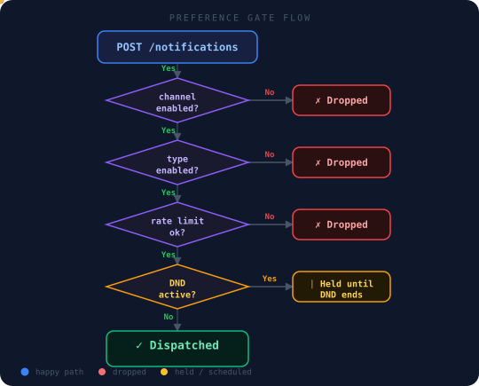

# Use Cases — Scalable Notification Service

Real-world scenarios that map directly to what this service supports.

---

## 1. E-commerce Platform

**Scenario:** Customer places an order

| Event | Channel | Type | Example message |
|-------|---------|------|-----------------|
| Order confirmed | Email | `transactional` | "Your order #1234 has been confirmed" |
| Package dispatched | SMS | `transactional` | "Your package is out for delivery" |
| Status updates | In-App | `transactional` | Real-time order tracking in the dashboard |
| Trial expiry reminder | Email | `transactional` | "Your trial expires in 3 days" (scheduled 3 days ahead) |
| Weekend flash sale | Email | `promotional` | "30% off everything this weekend" |

---

## 2. Banking / Fintech

**Scenario:** Account activity monitoring

| Event | Channel | Type | Example message |
|-------|---------|------|-----------------|
| Debit alert | SMS | `transactional` | "₦50,000 debited from your account" |
| Suspicious login | Push | `system_alert` | "Unusual login detected from a new device" |
| Low balance warning | Email | `transactional` | "Your balance has fallen below ₦1,000" |

**Preference pattern:** User opts out of `promotional`, keeps `transactional` and `system_alerts` enabled.

---

## 3. SaaS Product

**Scenario:** User lifecycle events

| Event | Channel | Type | Example message |
|-------|---------|------|-----------------|
| Email verification | Email | `transactional` | "Please verify your email address" |
| Password reset | Email | `transactional` | "Here is your password reset link" |
| Feature announcement | Email | `promotional` | "Meet our new dashboard — now live!" |
| Weekly activity digest | Email | `promotional` | Rate-limited to `max_promotional_per_day: 2` |
| Scheduled maintenance | Email | `system_alert` | "Maintenance window: Apr 30, 02:00–04:00 UTC" |

**Preference pattern:** User sets `dnd_start_hour: 22, dnd_end_hour: 7` — no notifications during overnight hours.

---

## 4. Healthcare App

**Scenario:** Patient reminders and alerts

| Event | Channel | Type | Example message |
|-------|---------|------|-----------------|
| Appointment reminder | SMS | `transactional` | "Reminder: your appointment is tomorrow at 10am" (scheduled 24hrs ahead) |
| Medication reminder | Push | `transactional` | "Time to take your medication" (scheduled daily) |
| Lab results ready | Email | `transactional` | "Your test results are now available" |

**Preference pattern:** Patient disables `promotional`, keeps `transactional` only.

---

## 5. DevOps / Internal Tooling

**Scenario:** Infrastructure monitoring and on-call alerts

| Event | Channel | Type | Example message |
|-------|---------|------|-----------------|
| High CPU usage | Email | `system_alert` | "CPU exceeded 90% on prod-server-1" |
| DB replication lag | SMS | `system_alert` | "Database replication lag > 30s" |
| Deployment completed | In-App | `system_alert` | Live alert feed in the internal ops dashboard |
| Disk space warning | Push | `system_alert` | "Disk usage at 85% on /dev/sda1" |

---

## 6. Ride-sharing / Delivery App

**Scenario:** Real-time driver and rider updates

| Event | Channel | Type | Example message |
|-------|---------|------|-----------------|
| Driver matched | Push | `transactional` | "Your ride has been matched" |
| Driver arriving | In-App | `transactional` | "Your driver is 2 minutes away" (live WebSocket push) |
| Trip completed | SMS | `transactional` | "Your trip is complete. Fare: ₦1,200" |
| Promo code | Push | `promotional` | "Use RIDE20 for 20% off your next trip" |

**Architecture note:** In-app WebSocket pushes remove the need for client-side polling — the message appears instantly the moment the API receives it.

---

## Channel × Type Decision Matrix

Use this as a quick reference when deciding which channel and type to use.

|  | `transactional` | `promotional` | `system_alert` |
|---|---|---|---|
| **email** | Order confirmations, password resets, invoices | Newsletters, feature announcements, offers | Maintenance windows, security notices |
| **sms** | OTP codes, delivery updates, debit alerts | Flash sales (use sparingly) | Critical outage alerts |
| **push** | Payment received, ride matched | New feature, promo code | Downtime warning, disk full |
| **inapp** | Live order/ride status, real-time feed | In-app offer banners | Live alert feed for ops dashboards |

---

## How Preferences Affect Delivery

Every notification passes through preference checks before being dispatched:

This means your application code never needs to check preferences — just call `POST /notifications` and the service handles the rest.
