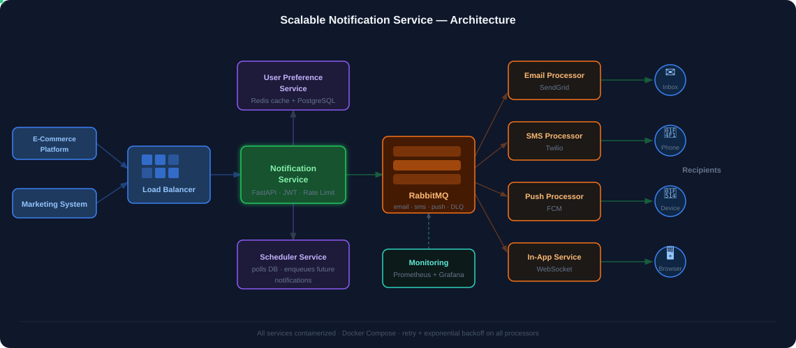

# Architecture

## High-Level Diagram



### ASCII Reference

```
 ┌──────────────────────────────────────────────────────────────────────┐
 │                         Clients / Services                           │
 │          (e-commerce platform, marketing system, alerts, etc.)       │
 └──────────────────────────────┬───────────────────────────────────────┘
                                │  POST /notifications
                                ▼
                   ┌────────────────────────────┐
                   │       Load Balancer /       │
                   │       API Gateway           │
                   └────────────┬───────────────┘
                                │
                                ▼
                   ┌────────────────────────────────────────────┐
                   │          Notification Service               │
                   │              (FastAPI)                      │◄── JWT auth
                   │                                            │◄── Rate limiting
                   └──────┬──────────┬──────────────┬───────────┘
                          │          │              │
              ┌───────────┘          │ 2.scheduled? │ 3a. in-app? write directly
              │ 1. check prefs       ▼              ▼
              │          ┌────────────────┐  ┌─────────────────────────────┐
              │          │   Scheduler    │  │   In-App Notification       │
              │          │   Service      │  │   Service (WebSocket)        │
              │          │                │  │                             │
              │          │ stores future  │  │  pushes to connected        │
              │          │ notifs in DB   │  │  clients instantly          │
              │          │ polls & enques │  │                             │
              │          └───────┬────────┘  │  if offline → stored in    │
              │                  │           │  notifications table        │
              ▼                  │           │  served via GET /inbox      │
 ┌────────────────────────┐      │           └──────────────┬──────────────┘
 │   User Preference      │      │                          │
 │   Service              │      │                          │ write status
 │                        │      │                          ▼
 │  ┌──────────────────┐  │      │        ┌──────────────────────────────────────┐
 │  │  Redis (cache)   │  │      │        │              PostgreSQL               │
 │  └────────┬─────────┘  │      │        │                                      │
 │           │ cache miss  │      │        │  users                notifications  │
 │           ▼             │      │        │  user_preferences  notification_logs │
 │  ┌──────────────────┐  │      │        │  scheduled_notifications             │
 │  │   PostgreSQL     │  │      │        └──────────────────────────────────────┘
 │  │ user_preferences │  │      │                          ▲
 │  └──────────────────┘  │      │                          │ write delivery status
 └────────────────────────┘      │                          │
              │ 3b. publish async message(s)                 │
              └──────────────────┬───────────────────────────┘
                                 │                           │
                                 ▼                           │
          ┌──────────────────────────────────────┐          │
          │               RabbitMQ                │          │
          │                                       │          │
          │  ┌─────────────┐  ┌────────────────┐  │          │
          │  │ email queue │  │ sms queue      │  │          │
          │  └─────────────┘  └────────────────┘  │          │
          │  ┌─────────────────────────────────┐  │          │
          │  │ push queue                      │  │          │
          │  └─────────────────────────────────┘  │          │
          │  ┌─────────────────────────────────┐  │          │
          │  │ Dead Letter Queue (DLQ)          │  │          │
          │  │ (messages that exceeded retries) │  │          │
          │  └─────────────────────────────────┘  │          │
          └───────┬──────────────┬────────────────┘          │
                  │              │         │                  │
    ┌─────────────┘   ┌──────────┘  ┌──────┘                 │
    ▼                 ▼             ▼                         │
┌──────────┐   ┌──────────┐  ┌──────────┐                    │
│  Email   │   │   SMS    │  │  Push    │                    │
│Processor │   │Processor │  │Processor │                    │
│          │   │          │  │          │                    │
│retry +   │   │retry +   │  │retry +   │                    │
│backoff   │   │backoff   │  │backoff   │                    │
└────┬─────┘   └────┬─────┘  └────┬─────┘                    │
     │              │             │                           │
     ▼              ▼             ▼                           │
 SendGrid        Twilio          FCM                          │
     │              │             │                           │
     └──────────────┴─────────────┴───────────────────────────┘
                                          write delivery status

          ┌──────────────────────────────────────────────────┐
          │           Prometheus + Grafana                    │
          │                                                   │
          │  scrapes /metrics from:                          │
          │   ← Notification Service                         │
          │   ← Email / SMS / Push Processors                │
          │   ← In-App Service                               │
          │   ← Scheduler Service                            │
          │                                                   │
          │  dashboards: throughput, latency,                │
          │  failure rate per channel                        │
          │  alerts on delivery failure thresholds           │
          └──────────────────────────────────────────────────┘
```

---

## Component Descriptions

### Notification Service (FastAPI)
Entry point for all notification requests. Validates requests, checks user preferences via the cache, optionally routes to the Scheduler, then publishes messages to RabbitMQ.

### User Preference Service
Reads/writes user preferences from PostgreSQL; results cached in Redis. Enforces opt-in/out and daily rate limits per channel before a notification is queued.

### Scheduler Service
Stores future-dated notifications in the `scheduled_notifications` table (partitioned by `scheduled_at`). A cron loop polls for due notifications and publishes them to RabbitMQ.

### RabbitMQ
Acts as the buffer between ingestion and delivery. Separate queues per channel allow independent scaling. A Dead Letter Queue (DLQ) captures messages that exceed retry limits.

### Channel Processors (Email, SMS, Push)
Each is a standalone service that consumes its RabbitMQ queue and delivers via the appropriate provider (SendGrid, Twilio, FCM). Implements exponential backoff retry and writes delivery status to `notification_logs`. Failed messages beyond the retry limit go to the DLQ.

### In-App Notification Service (WebSocket)
Bypasses RabbitMQ entirely. The Notification Service writes the notification directly to the `notifications` table and the WebSocket server pushes it to connected clients instantly. If the user is offline, the notification sits in the `notifications` table and is served on demand via `GET /users/:id/notifications` (the inbox endpoint).

### PostgreSQL
Stores: users, notifications, notification_logs, user_preferences, scheduled_notifications.

### Redis
Caches user preferences to avoid hot-path DB reads on every notification dispatch.

### Prometheus + Grafana
Prometheus scrapes metrics from each service. Grafana dashboards visualize throughput, delivery latency, and failure rates per channel. Each service emits structured JSON logs via `structlog` (ready to forward to any log aggregator).

---

## Database Schema (Summary)

| Table | Purpose |
|-------|---------|
| `users` | User identity and basic info |
| `user_preferences` | Per-user channel opt-ins, rate limits |
| `notifications` | Core notification records |
| `notification_logs` | Delivery attempt history (status, timestamps) |
| `scheduled_notifications` | Future notifications pending delivery |

---

## Scalability Notes

- Each service is independently deployable and horizontally scalable
- RabbitMQ → Kafka migration path exists for >10K sustained msg/sec
- PostgreSQL tables partitioned by time for large-volume log queries
- Redis cluster mode available for preference cache at scale
- Multi-AZ PostgreSQL replication for 99.99% availability target
